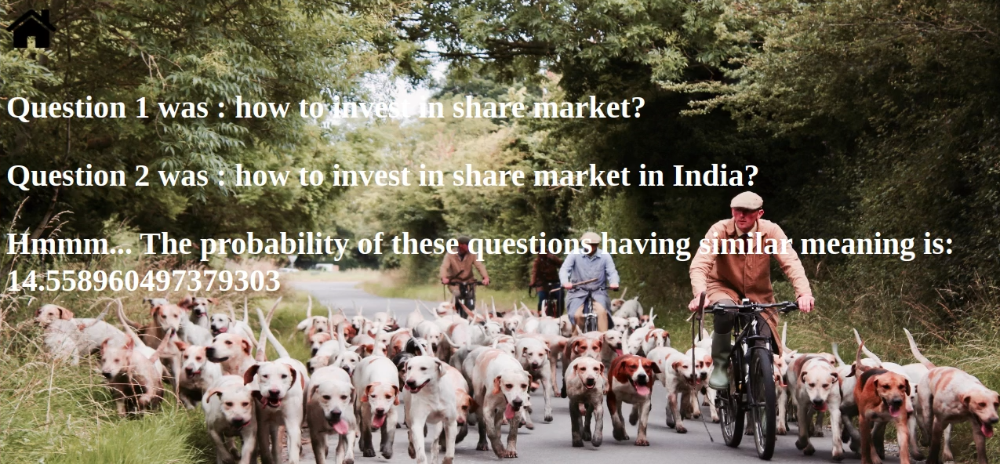

# Predict_similarity_between_Questions
A Keras model that addresses the Quora Question Pairs dynamic prediction task integrated within a web application built using Django.

The model architecture is based on the Stanford Natural Language Inference benchmark model developed by Stephen Merity , specifically the version using a simple summation of GloVe word embeddings  to represent each question in the pair. A difference between this and the Merity SNLI benchmark is that our final layer is Dense with sigmoid activation, as opposed to softmax. Another key difference is that we are using the max operator as opposed to sum to combine word embeddings into a question representation. We use binary cross-entropy as a loss function and Adam for optimization.

